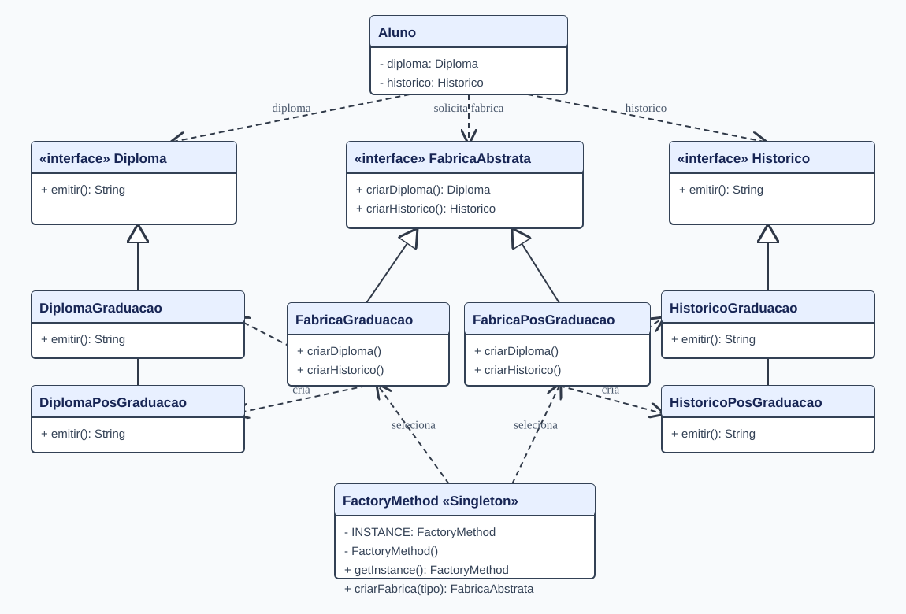

# Unificar padrões de criação

Desafio de Arquitetura de Software: combinar Abstract Factory, Factory Method e Singleton no mesmo fluxo, seguindo a família de diplomas e históricos do diagrama fornecido.

## Como funciona

1. `Aluno` pede uma fábrica para `FactoryMethod.getInstance().criarFabrica(tipo)`.
2. `FactoryMethod` é um Singleton: todas as chamadas usam a mesma instância. Seu método escolhe uma das implementações de `FabricaAbstrata`.
3. A fábrica concreta entrega uma família coerente de produtos: diploma e histórico de graduação ou ambos de pós-graduação.

`new Aluno("graduacao")` e `new Aluno("posgraduacao")` demonstram as duas famílias. `mvn test` executa os testes.

Baseado nos repositórios [Abstract Factory](https://github.com/ecob5/Abstract-Factory), [Factory Method](https://github.com/ecob5/Factory-Method) e [Singleton](https://github.com/ecob5/Singleton) do aluno e no diagrama disponibilizado para o desafio. No diagrama original, `Class` e `Object` indicam o uso de reflexão na seleção da fábrica; aqui a seleção é explícita com `switch`, mantendo o mesmo papel de Factory Method e reduzindo erros de nome de classe.
